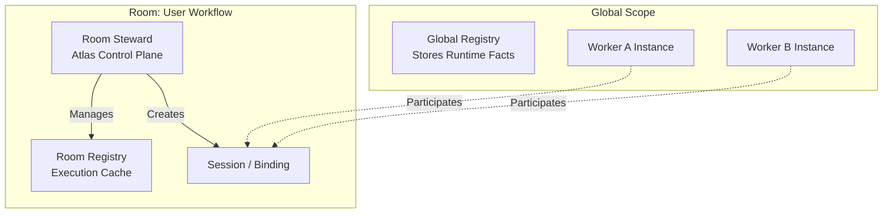
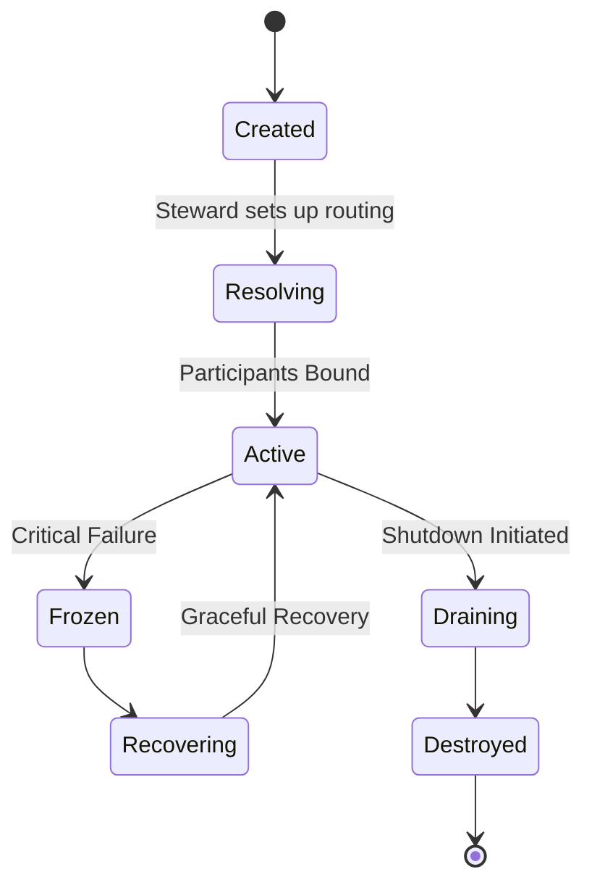

# Execution Model (v1.0)

This document defines the universal execution model for the Atlas Software Platform.

## The Core Primitives

The Atlas execution model is built upon six unchangeable primitives:
1. **Worker:** The only executable primitive. Owns business logic and state.
2. **Room:** An execution context representing a collaboration between Workers.
3. **Session:** The communication primitive inside a Room.
4. **Registry:** Stores runtime facts (Global and Room-local).
5. **Binding:** A negotiated connection between Workers.
6. **Invocation:** A specific execution request processed by a Worker.

---

## 1. The Global Architecture

## 2. Rooms and the Steward

A **Room** is not an application or a container. It is a communication and collaboration context. Rooms are typically created by orchestration Workers (Managers). 
Nested Rooms are supported but considered exceptional.

Inside every Room sits the **Room Steward**. The Steward is Atlas. It manages the Room Lifecycle, maintains the Room Registry, enforces permissions, and sets up routing. The Steward **never** executes business logic.

### Room Lifecycle States

## 3. Registries

**The Global Registry** stores facts about available Models, available capabilities, running Workers, and running Rooms.
**The Room Registry** functions as a local execution cache. It stores Participant Bindings, the Transport Table, Active Invocations, and local metrics. Workers inside a Room query the Room Registry, minimizing global bottlenecks.

## 4. Communication Layers

To ensure strict language neutrality, communication is sliced into three layers owned by Atlas:
1. **Communication:** Who is talking (Headers, Intent).
2. **Transport:** How bytes move (Shared Memory, TCP, Unix Sockets).
3. **Translation:** How runtimes understand each other (e.g., Python to Rust).

Workers communicate by sending a Header. The Header describes intent (e.g., `Required: Storage, Optional: Analytics`). Atlas reads this metadata and decides whether to create a new Room or establish direct Sessions.

## 5. Execution and Invocations

Workers do not execute Sessions directly. Every request sent over a Session becomes an **Invocation**. Workers execute Invocations based on their declared scheduling metadata (Singleton, Parallel, Pool). 
