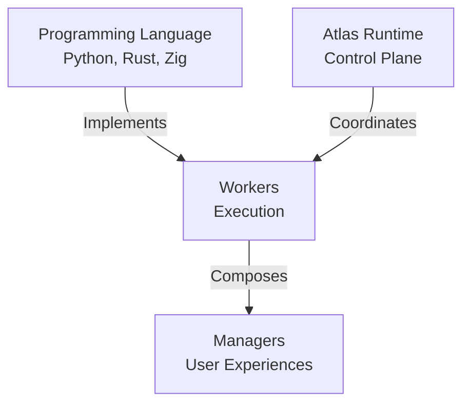

# Architecture

The Atlas Software Platform is built upon a strict, language-agnostic execution model.

## 1. Solon Toolchain
Solon is the Atlas developer toolchain. It validates Workers against Models *before* runtime, ensuring cross-language interoperability and generating necessary SDKs and test mocks.

## 2. Models
Models are the ideal, tool-independent specifications (YAML/JSON) that dictate how a Capability should behave.

## 3. Workers
Workers are the **ONLY** executable primitive. They implement Models. They execute **Invocations**.

## 4. The Runtime (Global Control Plane)
The Atlas Runtime handles Discovery, the Global Registry, and Lifecycle coordination. 
Atlas NEVER owns business state. Atlas NEVER guesses; it only executes declared intent.

## 5. Rooms (Execution Contexts)
When Workers collaborate, they do so inside a **Room**. A Room is not an application; it is a context managed by a **Room Steward** (Atlas). The Steward maintains a **Room Registry** (execution cache) and negotiates **Bindings** and **Sessions** over three independent layers: Communication, Transport, and Translation.
