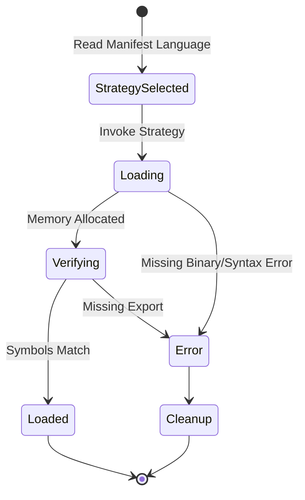

# Phase 1.1: Dynamic Loader Implementation Specification

The Dynamic Loader abstracts OS-level execution contexts. It bridges the gap between the language-neutral Atlas Runtime and language-specific Worker implementations (Python, Rust, Native binaries).

---

## 1. Language Abstraction Interface

To support multi-language execution, the loader defines an abstract plugin strategy interface.

```typescript
interface LanguageLoaderStrategy {
    // Loads the executable into memory and returns a handle.
    load(manifest: WorkerManifest, source_path: String) -> Result<ExecutableHandle, LoadError>;
    
    // Unloads the code from memory (if supported by the language).
    unload(handle: ExecutableHandle) -> Result<(), UnloadError>;
    
    // Verifies the entry point defined by the language exists.
    verify_entry_point(handle: ExecutableHandle) -> Result<(), MissingSymbolError>;
}
```

### Python Strategy Example
- Uses `importlib.util.spec_from_file_location`.
- Requires `__init__.py` or standard entry module.
- `ExecutableHandle` is the loaded Python module object.

### Native / Rust Strategy Example
- Uses `dlopen()` (Unix) or `LoadLibrary()` (Windows).
- `ExecutableHandle` is an OS-level pointer.

## 2. Public API

```typescript
interface DynamicLoader {
    // Evaluates manifest.language and delegates to the correct strategy.
    load_worker(manifest: WorkerManifest) -> Result<WorkerInstance, LoaderError>;
    
    // Graceful unload (hot-reload prep).
    unload_worker(worker_id: String) -> Result<(), LoaderError>;
    
    // Reloads code in-place.
    reload_worker(worker_id: String) -> Result<WorkerInstance, LoaderError>;
}
```

## 3. Data Structures & Ownership

```typescript
struct WorkerInstance {
    readonly id: String;
    readonly manifest: WorkerManifest;
    
    // The raw pointer or module object. Owned by the DynamicLoader.
    readonly _executable_handle: ExecutableHandle; 
    
    // The language-agnostic interface exposed to Atlas.
    readonly interface: WorkerProtocol; 
}
```
**Ownership:** 
The `DynamicLoader` retains strict ownership of `ExecutableHandle`. If the `DynamicLoader` drops the handle (e.g., during `unload()`), the `WorkerInstance` immediately becomes invalid. The Global Registry holds a weak reference to `WorkerInstance`.

## 4. Loading Lifecycle & Failure Recovery



### Failure Recovery
If a Worker fails to load (e.g., syntax error in a Python module, missing `.so` file):
1. The error is wrapped in a structured `LoadError`.
2. The Strategy explicitly frees any partially allocated memory (e.g., `dlclose()`).
3. The Loader returns `Err` to the caller. The Global Registry is *never* updated with a broken Worker.

## 5. Hot Reload & Unloading
Hot Reload is handled as a `unload -> load` sequence. 
Because Python cannot safely unload modules natively (due to `sys.modules` caching), the Python strategy will implement a namespace sandbox or require process-level isolation for true hot reloading in future phases. For Phase 1.1, Python `unload()` acts as a soft-deregister, relying on the GC.

## 6. Memory Management
Memory layout is strictly managed by the Language Strategy. The Core Runtime must never interact with the `ExecutableHandle` directly; it must always proxy through the `WorkerProtocol` interface to guarantee memory safety.
