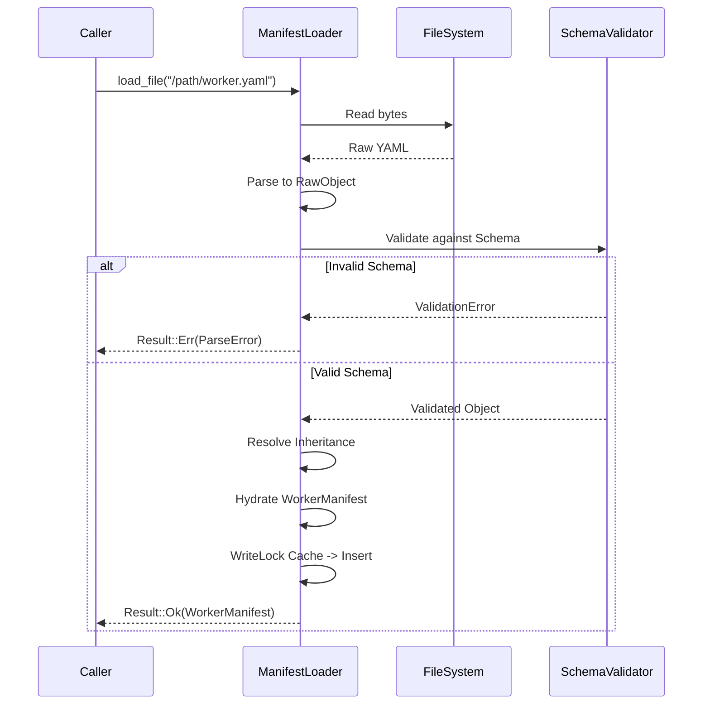

# Phase 1.1: Manifest Loader Implementation Specification

The Manifest Loader is responsible for discovering, parsing, validating, and caching `worker.yaml` files. It guarantees that the Runtime only ever interacts with structurally valid, immutable manifest data.

---

## 1. Directory Layout

The loader expects the following structure for any installed Worker:
```text
/installed_workers
  /worker_name
    worker.yaml         (Required: The canonical manifest)
    /assets             (Optional: Static assets)
    /src                (Required: Executable code)
```

## 2. Public API

```typescript
interface ManifestLoader {
    // Primary entry point. Discovers and loads all manifests in a directory.
    load_directory(path: String) -> Result<List<WorkerManifest>, AggregateError>;
    
    // Loads a single manifest.
    load_file(path: String) -> Result<WorkerManifest, ParseError>;
    
    // Returns a cached manifest by Worker ID.
    get_cached(worker_id: String) -> Option<WorkerManifest>;
}
```

## 3. Internal API & Parser Architecture

```typescript
// Stage 1: Raw I/O
_read_bytes(path: String) -> Result<Bytes, IOError>;

// Stage 2: YAML/JSON Parsing (Syntax)
_parse_yaml(data: Bytes) -> Result<RawObject, SyntaxError>;

// Stage 3: Schema Validation (Structure)
_validate_schema(data: RawObject) -> Result<RawObject, ValidationError>;

// Stage 4: Inheritance Resolution (Base Models)
_resolve_inheritance(data: RawObject) -> Result<RawObject, ResolutionError>;

// Stage 5: Hydration (Domain Object)
_hydrate_manifest(data: RawObject) -> WorkerManifest;
```

## 4. Internal Data Structures (Immutable Structs)

Once hydrated, the Manifest is deeply immutable.
```typescript
struct WorkerManifest {
    readonly id: String;
    readonly name: String;
    readonly version: String; // SemVer parsed
    readonly language: String;
    readonly roles: List<String>;
    
    readonly execution: ExecutionPolicy;
    readonly communication: CommunicationPolicy;
    
    readonly imports: List<ImportDefinition>;
    readonly exports: List<ExportDefinition>;
}

struct ImportDefinition {
    readonly capability_name: String;
    readonly version_requirement: String;
    readonly optional: Boolean;
}

struct ExportDefinition {
    readonly capability_name: String;
    readonly version: String;
}
```

## 5. Manifest Caching & Thread Safety

**State:**
`_cache: Map<String, WorkerManifest>`

**Thread Safety:**
The cache is protected by a **Readers-Writer Lock (RwLock)**.
- Multiple threads can read the cache simultaneously via `get_cached()`.
- Only the loader thread can acquire a Write Lock during `load_directory()`.

**Caching Strategy:**
Manifests are cached using the absolute file path and SHA-256 hash of the `worker.yaml` file to prevent duplicate parsing.

## 6. Sequence Diagram: Load Flow



## 7. Performance Considerations
- Disk I/O should be asynchronous or heavily batched.
- YAML parsing is notoriously slow; the parser should ideally use a C-extension or native parser binding (e.g., `libyaml` via PyYAML CLoader).
- Inherited manifests (e.g., extending a base `database.yaml`) are resolved *before* caching to avoid runtime lookups.

## 8. Extension Points
- **Remote Loaders:** Designing `_read_bytes` behind an interface allows future extension to fetch manifests from a network URL or IPFS.
