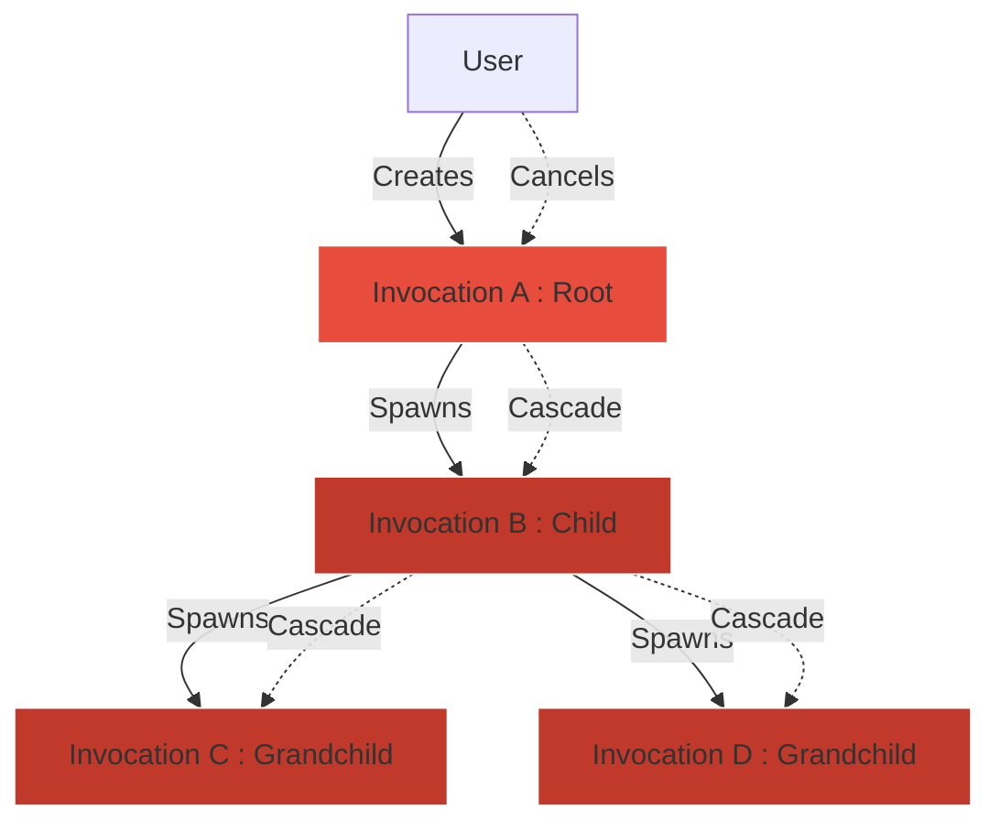

# Phase 1: Invocation Engine

The Invocation Engine introduces `Invocations` as the fundamental unit of work in Atlas. While the Session Manager governs *how* workers talk, the Invocation Engine governs *what* workers are doing. Importantly, it separates the representation of work from the scheduling of work.

## Responsibilities
- Create, track, and destroy Invocations across the entire network.
- Enforce the strict State Machine Lifecycle.
- Reconstruct Parent/Child traces (Telemetry).
- Broadcast Cancellation cascades.

## Invocation Context
When a worker executes an Invocation, it receives an immutable `InvocationContext`. This context tracks the `correlation_id` and the `root_id`. If a worker performs secondary requests (child invocations), Atlas guarantees the `root_id` and `correlation_id` propagate down the entire tree.

## Lifecycle State Machine
Every Invocation enforces strict state transitions. Illegal transitions will immediately raise an `InvocationStateError` (Severity: RECOVERABLE).

`CREATED -> QUEUED -> DISPATCHED -> EXECUTING -> WAITING -> COMPLETED | CANCELLED | TIMED_OUT | FAILED`

## Cooperative Cancellation
Cancellation in Atlas is a top-down cascade. If a user cancels a Root Invocation (e.g., they closed the application), Atlas does not just kill the process. 
Instead:
1. Atlas flags `cancellation_requested = True` on the Root.
2. The Invocation Engine recursively finds every active child/descendant Invocation in the Registry.
3. Every descendant is flagged for cancellation simultaneously.
4. Workers observe the flag and terminate safely.

### Architecture

