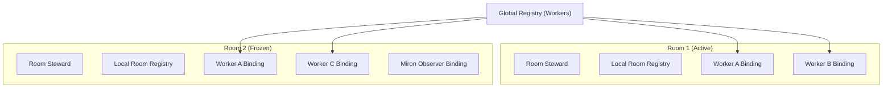

# Phase 1: Room Manager

The Room Manager introduces the `Room` as Atlas' core execution context. A Room provides a scoped collaboration boundary where Workers interact. Crucially, Rooms never "own" workers; workers remain globally managed and can participate in multiple Rooms simultaneously. Rooms only own `Bindings`.

## Responsibilities
- Provide a local `RoomRegistry` execution cache to minimize global lock contention.
- Expose the Room Steward to enforce the state machine.
- Manage Freeze / Recovery lifecycles.
- Enforce nesting limits and global scale constraints.
- Securely grant `Observer` bindings to external telemetry systems (Miron).

## The Room Steward
Every Room is managed by an internal `RoomSteward`. This steward manages the bindings and synchronizes the local `RoomRegistry`. It ensures that when a worker looks up a capability, it searches its local room context first.

## Freeze & Recovery Lifecycle
If a critical worker inside a Room fails, Atlas does not crash the entire Room. Instead:
1. The Steward transitions the Room to `FROZEN`.
2. All outstanding Invocations inside this context are instantly paused.
3. The system waits for an external Recovery Hook (e.g., Miron restarting the worker or rebinding a fallback).
4. Upon recovery, the Steward transitions the Room back to `ACTIVE` and resumes the invocations.

`CREATED -> RESOLVING -> ACTIVE -> FROZEN -> RECOVERING -> DRAINING -> DESTROYED`

## Observer Bindings
Miron and other diagnostic systems attach to Rooms via Observer Sessions. The Steward guarantees that any participant bound with `is_observer=True` has read-only access to the Room Registry and can never mutate state or create new Invocations.

### Architecture

