# Phase 1: Translation Layer

The Translation Layer acts as a metadata-driven graph orchestrator. Atlas never translates data itself; instead, it dynamically composes **Translator Workers** into optimal translation chains.

## Responsibilities
- Discover compatible Translator Workers from the Global Registry.
- Utilize **Dijkstra's Shortest Path Algorithm** to construct the cheapest path between two arbitrary formats.
- Remain completely agnostic to the specific data payloads (Atlas only compares format strings like `"python"` and `"json"`).

## The Translator Model
A Translator Worker is an ordinary Atlas Worker that advertises its capabilities via `TranslationDefinitions` in its manifest.

```yaml
translations:
  - source_format: "python"
    target_format: "json"
    cost: 1
```

If Worker A (Python) wants to talk to Worker B (C++), and no direct translator exists, Atlas will automatically route the bytes through an intermediate format (e.g., JSON -> Rust -> C++) if that is the cheapest valid path on the Translation Graph.

### Architecture

```mermaid
graph TD
    A[Worker: Python] -->|python bytes| B[Translator: python -> json]
    B -->|json bytes| C[Translator: json -> cpp]
    C -->|cpp bytes| D[Worker: C++]
    
    style A fill:#34495e,stroke:#fff
    style D fill:#34495e,stroke:#fff
    style B fill:#1abc9c,stroke:#fff
    style C fill:#1abc9c,stroke:#fff
```



## Constraints Checked
- **No Hardcoded Languages:** Translators use generic abstract strings. `python` is treated identically to `schema-v1`.
- **Cache Invalidation:** Because graph traversal can be expensive, computed paths are cached. This cache is instantly wiped if a new Translator Worker is installed or removed from the system.
