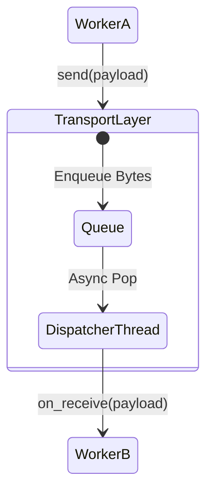

# Phase 1: Transport Layer

The Transport Layer is the foundational communication primitive in Atlas. Its sole responsibility is moving raw bytes from a source to a target.

## Responsibilities
- Deliver payloads asynchronously without blocking the execution thread.
- Remain entirely agnostic to serialization formats, capabilities, and business logic.
- Provide a common interface (`TransportStrategy`) for any future physical transport layer (e.g., TCP, WebSockets, IPC).

## InMemoryTransport
For the v1.0 Python implementation, the primary transport strategy is `InMemoryTransport`. 
It utilizes a thread-safe `queue.Queue` backed by a dedicated dispatcher daemon thread. 
This guarantees that `transport.send()` returns instantly (in $O(1)$ time), preventing deadlocks if two workers attempt to send bytes to each other simultaneously.

### Architecture

## Constraints Checked
- **No Serialization:** The `TransportPayload` strictly requires `bytes`. 
- **No Instantiation:** The transport layer assumes Workers are already instantiated and listeners are registered by higher orchestration layers.
